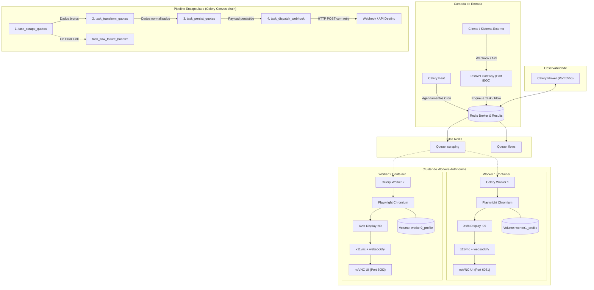

# 🚀 Omni-Flow: Advanced Web Scraping & Async Automation Platform

> Arquitetura corporativa em Python para Web Scraping avançado, pipelines ETL ponta a ponta e automações orientadas a eventos. Projetado para substituir ferramentas no-code (como n8n) com código testável, tipado, resiliente e escalável.

[](https://www.python.org/)
[](https://fastapi.tiangolo.com/)
[](https://docs.celeryq.dev/)
[](https://playwright.dev/python/)
[](https://docs.docker.com/compose/)
[](https://redis.io/)

---

## 📑 Sumário

- [Visão Geral da Arquitetura](#-visão-geral-da-arquitetura)
- [Por que substituir o n8n?](#-por-que-substituir-o-n8n)
- [Diagrama de Arquitetura](#-diagrama-de-arquitetura)
- [Estrutura do Repositório](#-estrutura-do-repositório)
- [Funcionalidades Técnicas](#-funcionalidades-técnicas)
  - [1. Orquestração e Pipelines (Celery Canvas)](#1-orquestração-e-pipelines-celery-canvas)
  - [2. Anti-Detecção e Comportamento Humano](#2-anti-detecção-e-comportamento-humano)
  - [3. Streaming Visual em Tempo Real (Xvfb + noVNC)](#3-streaming-visual-em-tempo-real-xvfb--novnc)
  - [4. Persistência de Sessão Isolada](#4-persistência-de-sessão-isolada)
- [🤖 Leitor Web para IA (Alternativa ao Firecrawl e Jina Reader)](#-leitor-web-para-ia-alternativa-ao-firecrawl-e-jina-reader)
- [🎯 API de Enriquecimento de Leads e Empresas (OSINT + IA)](#-api-de-enriquecimento-de-leads-e-empresas-osint--ia)
- [Matriz de Portas e Serviços](#-matriz-de-portas-e-serviços)
- [Guia de Inicialização Rápida](#-guia-de-inicialização-rápida)
- [Como Testar e Disparar Fluxos](#-como-testar-e-disparar-fluxos)
- [Monitoramento em Tempo Real](#-monitoramento-em-tempo-real)

---

## 🏛 Visão Geral da Arquitetura

O **Omni-Flow** une a velocidade do **FastAPI**, o poder distribuído do **Celery** sobre **Redis**, e o controle fino de navegação do **Playwright** operando sobre displays virtuais **Xvfb**.

Cada worker opera de forma isolada em seu próprio container Docker, executando seu próprio servidor X11, servidor VNC e cliente web **noVNC**, permitindo que você assista à raspagem de dados acontecendo em tempo real via navegador.

```
                    ┌─────────────────────────┐
                    │   Disparadores Externos │
                    │ (Webhooks, Cron, Users) │
                    └────────────┬────────────┘
                                 │ HTTP POST
                                 ▼
                     ┌───────────────────────┐
                     │    FastAPI Gateway    │ (Porta 8000)
                     │     (/api/v1/...)     │
                     └───────────┬───────────┘
                                 │
           ┌─────────────────────┴─────────────────────┐
           ▼                                           ▼
┌─────────────────────┐                     ┌─────────────────────┐
│     Celery Beat     │ (Scheduler)         │     Redis Broker    │ (Filas: scraping,
│ (Rotinas Agendadas) │                     │   & Result Store    │  flows, default)
└──────────┬──────────┘                     └──────────┬──────────┘
           │                                           │
           └───────────────────┬───────────────────────┘
                               │
            ┌──────────────────┴──────────────────┐
            ▼                                     ▼
┌───────────────────────────────┐   ┌───────────────────────────────┐
│           WORKER 1            │   │           WORKER 2            │
│ ┌───────────────────────────┐ │   │ ┌───────────────────────────┐ │
│ │  Celery Worker (Concurr.) │ │   │ │  Celery Worker (Concurr.) │ │
│ ├───────────────────────────┤ │   │ ├───────────────────────────┤ │
│ │  Playwright (Chromium)    │ │   │ │  Playwright (Chromium)    │ │
│ ├───────────────────────────┤ │   │ ├───────────────────────────┤ │
│ │  Display Virtual (Xvfb)   │ │   │ │  Display Virtual (Xvfb)   │ │
│ ├───────────────────────────┤ │   │ ├───────────────────────────┤ │
│ │  x11vnc + noVNC (p: 6081) │ │   │ │  x11vnc + noVNC (p: 6082) │ │
│ └───────────────────────────┘ │   │ └───────────────────────────┘ │
│ Volume: worker1_profile       │   │ Volume: worker2_profile       │
└───────────────────────────────┘   └───────────────────────────────┘
```

---

## 🥊 Por que substituir o n8n?

| Requisito | n8n / Ferramentas No-Code | Omni-Flow (Python + Celery + Playwright) |
| :--- | :--- | :--- |
| **Execução de Browsers** | Execução pesada, memory leaks frequentes, headless opaco | Workers isolados com garbage collection real e Xvfb |
| **Streaming Visual** | Inexistente ou complexo | **noVNC nativo** em portas independentes (`6081`, `6082`) |
| **Técnicas Anti-Bot** | Muito limitado, fingerprint fácil de detectar | Injeção profunda de protótipos JS, WebGL, jitter e digitação humana |
| **Retries e Resiliência** | Difícil de gerenciar retries por nó com backoff exponencial | `autoretry_for`, `retry_backoff=True`, jitter e Celery Canvas `link_error` |
| **Testabilidade** | Impossível testar via CI/CD clássico | 100% testável com `pytest`, mocks e integração contínua |
| **Versionamento** | JSONs complexos e propensos a conflitos de merge | Código Python limpo, modular, versionado via Git |

---

## 📊 Diagrama de Arquitetura



---

## 📁 Estrutura do Repositório

```
playwright-celery-automation/
├── .env.example              # Modelo de variáveis de ambiente
├── .gitignore                # Regras de exclusão do Git
├── Dockerfile                # Imagem base com Python, Playwright, Xvfb, noVNC
├── docker-compose.yml        # Orquestração dos 6 serviços e volumes isolados
├── entrypoint.sh             # Script de boot inteligente (Xvfb, VNC, Uvicorn, Celery)
├── requirements.txt          # Dependências Python (FastAPI, Celery, Playwright, etc.)
├── README.md                 # Documentação completa do sistema
│
├── api/                      # Camada de Gateway HTTP
│   ├── __init__.py
│   ├── main.py               # Instância FastAPI, middlewares, rotas e health checks
│   ├── routes/
│   │   ├── __init__.py
│   │   ├── flows.py          # Endpoints para disparo de automações
│   │   ├── tasks.py          # Consulta assíncrona de status de tarefas
│   │   └── webhooks.py       # Receptor de webhooks externos
│   └── schemas/
│       ├── __init__.py
│       └── requests.py       # Modelos Pydantic para validação de dados
│
├── core/                     # Núcleo de configuração e broker
│   ├── __init__.py
│   ├── config.py             # Configurações Pydantic Settings
│   └── celery_app.py         # Instância Celery, rotas de fila e agendamento Beat
│
├── flows/                    # Pipelines e fluxos de automação (Substituindo n8n)
│   ├── __init__.py
│   ├── example_flow.py       # Pipeline linear encadeado (`chain`) com retry
│   ├── parallel_flow.py      # Pipeline paralelo distribuído (`chord` + `group`)
│   └── tasks_etl.py          # Steps atômicos do pipeline (scrape, transform, persist, notify)
│
├── scrapers/                 # Camada de Web Scraping e Evasão
│   ├── __init__.py
│   ├── base.py               # Gerenciador de contexto persistente Playwright
│   ├── stealth.py            # Injeção de scripts anti-detecção (mask webdriver, plugins)
│   ├── humanizer.py          # Digitação cadenciada, scroll suave e pausas orgânicas
│   └── quote_scraper.py      # Scraper concreto de exemplo
│
├── storage/                  # Persistência e auditoria de execuções
│   ├── __init__.py
│   └── repository.py         # Repositório SQLite com WAL para gravação thread-safe
│
└── tests/                    # Bateria de testes automatizados
    ├── __init__.py
    ├── test_api.py           # Testes unitários dos endpoints FastAPI
    └── test_flow.py          # Testes das transformações e storage
```

---

## ⚡ Funcionalidades Técnicas

### 1. Orquestração e Pipelines (Celery Canvas)
Elimina o n8n através de pipelines puramente em Python com garantia de execução:
- **`chain` (Sequencial):**
  ```python
  workflow = chain(
      task_scrape_quotes.s(source_url=url, max_items=10),
      task_transform_quotes.s(),
      task_persist_quotes.s(),
      task_dispatch_webhook.s(webhook_url=webhook_url),
  )
  workflow.apply_async(link_error=task_flow_failure_handler.s())
  ```
- **`chord` / `group` (Paralelo Distribuído):**
  Distribui a raspagem de 10 páginas simultaneamente entre o `worker-1` e o `worker-2`, sincronizando ao final em uma etapa agregadora.
- **Políticas de Retry com Backoff Exponencial:**
  ```python
  @celery_app.task(
      bind=True,
      autoretry_for=(httpx.HTTPError, httpx.TimeoutException),
      retry_backoff=True,
      retry_backoff_max=300,
      retry_jitter=True,
      max_retries=3,
  )
  ```

### 2. Anti-Detecção e Comportamento Humano
- **Evasão profunda:** Injeção de script via `add_init_script` antes de qualquer execução na página:
  * Remoção do marcador `navigator.webdriver`.
  * Emulação da API `window.chrome.runtime` e `window.chrome.app`.
  * Mascaramento de WebGL Vendor (`Google Inc. (NVIDIA)`).
  * Spoofing de plugins reais e `navigator.languages`.
- **Interações Humanizadas:**
  * Digitação ritmo variável (`human_type`): variações randômicas de 40ms a 160ms entre teclas com micro-pausas.
  * Rolagem suave (`human_scroll`): passos de leitura variáveis simulando comportamento ocular.

### 3. Streaming Visual em Tempo Real (Xvfb + noVNC)
Cada worker roda:
1. Servidor X virtual (`Xvfb :99`).
2. Gerenciador de janelas ultra-leve (`fluxbox`).
3. Servidor VNC (`x11vnc`).
4. Ponte WebSocket para HTTP (`websockify` + `noVNC`).

Ao acessar a porta correspondente no seu navegador, você vê a tela completa do Chromium abrindo, digitando, clicando e navegando ao vivo!

### 4. Persistência de Sessão Isolada
- Cada worker possui um volume Docker independente mapeado para seu `user_data_dir`:
  * Worker 1: `worker1_profile:/app/data/browser_profile`
  * Worker 2: `worker2_profile:/app/data/browser_profile`
- Os cookies, sessões de autenticação, cache local e LocalStorage são mantidos entre tarefas, evitando bloqueios por login frequente e permitindo fluxos contínuos.

---

## 🤖 Leitor Web para IA (Alternativa ao Firecrawl e Jina Reader)

O Omni-Flow possui um mecanismo nativo capaz de acessar **qualquer site** e retornar o conteúdo limpo, estruturado e **100% otimizado para LLMs e Agentes de IA** (como GPT-4, Claude, Gemini e Llama).

### O que o extrator faz:
1. **Eliminação de Ruído:** Remove anúncios, barras de navegação, rodapés, banners de cookies/GDPR, scripts, estilos, iframes e popups.
2. **Preservação Semântica:** Mantém a hierarquia de títulos (`#`, `##`), listas, blocos de código com linguagem identificada, citações e converte tabelas HTML em tabelas Markdown legíveis.
3. **Limpeza de Links:** Preserva links úteis mas remove parâmetros de rastreamento (`utm_source`, `fbclid`, etc.) economizando tokens no contexto da IA.
4. **Métricas de Contexto:** Devolve estimativa exata de tokens (`tokens_estimated`), contagem de palavras e metadados completos (título, autor, data de publicação, descrição).
5. **Dual Engine Resiliente (`mode: auto`):** Tenta requisição rápida HTTP; se detectar páginas em JavaScript (SPAs como React, Next.js, Vue) ou proteções anti-bot, chaveia automaticamente para o Playwright Chromium com Stealth!

### 📌 Exemplos de Uso:

#### 1. Atalho Direto Estilo Jina Reader (`/r/{url}`)
Basta passar a URL e receber Markdown puro diretamente no corpo da resposta:
```bash
curl "http://localhost:8000/r/https://github.com/torvalds/linux"
```

#### 2. Extração Estruturada via JSON (`POST /api/v1/extract`)
```bash
curl -X POST "http://localhost:8000/api/v1/extract" \
     -H "Content-Type: application/json" \
     -d '{
       "url": "https://pt.wikipedia.org/wiki/Intelig%C3%AAncia_artificial",
       "mode": "auto",
       "format": "markdown",
       "include_links": true
     }'
```

**Exemplo de Resposta:**
```json
{
  "status": "success",
  "url": "https://pt.wikipedia.org/wiki/Intelig%C3%AAncia_artificial",
  "mode_used": "fast",
  "tokens_estimated": 3840,
  "word_count": 2910,
  "reading_time_minutes": 14.5,
  "metadata": {
    "title": "Inteligência artificial – Wikipédia, a enciclopédia livre",
    "description": "A inteligência artificial (IA) é um campo da ciência da computação...",
    "author": null,
    "published_time": null,
    "language": "pt",
    "canonical_url": "https://pt.wikipedia.org/wiki/Intelig%C3%AAncia_artificial",
    "domain": "pt.wikipedia.org"
  },
  "content": "# Inteligência artificial\n\nInteligência artificial (por vezes mencionada pela sigla em inglês AI)...",
  "links": [
    {
      "text": "ciência da computação",
      "url": "https://pt.wikipedia.org/wiki/Ci%C3%AAncia_da_computa%C3%A7%C3%A3o"
    }
  ]
}
```

#### 3. Extração em Lote Paralela via Celery (`POST /api/v1/extract/batch`)
Distribui uma lista de dezenas ou centenas de links pelos workers para extração assíncrona concorrente:
```bash
curl -X POST "http://localhost:8000/api/v1/extract/batch" \
     -H "Content-Type: application/json" \
     -d '{
       "urls": [
         "https://en.wikipedia.org/wiki/Python_(programming_language)",
         "https://en.wikipedia.org/wiki/FastAPI",
         "https://en.wikipedia.org/wiki/Celery_(software)"
       ],
       "mode": "auto"
     }'
```

---

## 🎯 API de Enriquecimento de Leads e Empresas (OSINT + IA)

Motor autônomo de inteligência de vendas e OSINT corporativo que transforma um nome de empresa e lista de contatos em um dossiê comercial 360° estruturado.

### 🌟 Capacidades Integradas:
1. **Google Search + Gemini 2.5:** Identificação automática de site oficial, apresentação corporativa, portfólio de produtos e modelo de negócio (B2B/SaaS/etc.).
2. **Receita Federal QSA:** Cruzamento do CNPJ público e Quadro de Sócios e Administradores para detecção oficial de sócios-fundadores e diretores.
3. **LinkedIn OSINT (Sem Bot Logado):** Mapeamento de perfis executivos (C-Level, VPs, Heads) via Google Dorks e extração de Company Pages institucionais.
4. **Auditoria de Contatos & Handshake SMTP Zero-Bounce:** Verificação de caixas de e-mail ativas sem disparo de mensagens e identificação do padrão corporativo (`nome@empresa.com`).
5. **Detecção de WhatsApp:** Validação em tempo real de números telefônicos ativos no WhatsApp via Evolution API.
6. **Inteligência de Vendas (SDR/BDR):** Sugestão estratégica de dores de mercado resolvidas, gancho de abordagem e melhor ponto de contato.

> 📖 **Documentação Técnica Completa:** Consulte o guia detalhado com todos os esquemas, payloads e exemplos em [docs/API_ENRICHMENT.md](file:///root/playwright-celery-automation/docs/API_ENRICHMENT.md).

#### Exemplo de Chamada Rápida (Unificada):
```bash
curl -X POST http://localhost:8000/api/v1/enrich \
     -H "Content-Type: application/json" \
     -d '{
       "name": "Matera",
       "location": "Campinas SP",
       "people": ["Carlos Netto"],
       "emails": ["carlos@matera.com"]
     }'
```

---

## 🌐 Matriz de Portas e Serviços

| Serviço | Porta no Host | Descrição | Como Acessar |
| :--- | :---: | :--- | :--- |
| **FastAPI Gateway** | `8000` | API REST & Documentação Swagger | [http://localhost:8000/docs](http://localhost:8000/docs) |
| **noVNC Worker 1** | `6081` | Streaming visual ao vivo do Worker 1 | [http://localhost:6081/vnc.html](http://localhost:6081/vnc.html) |
| **noVNC Worker 2** | `6082` | Streaming visual ao vivo do Worker 2 | [http://localhost:6082/vnc.html](http://localhost:6082/vnc.html) |
| **Celery Flower** | `5555` | Dashboard de monitoramento de tarefas Celery | [http://localhost:5555](http://localhost:5555) |
| **Redis** | `6379` *(interno)* | Broker de mensagens e result store | Rede interna Docker |

---

## 🚀 Guia de Inicialização Rápida

### 1. Clonar o repositório
```bash
git clone https://github.com/fernandobnog/playwright-celery-automation.git
cd playwright-celery-automation
```

### 2. Configurar o ambiente
```bash
cp .env.example .env
```

### 3. Subir o cluster Docker
```bash
docker compose up -d --build
```

Verifique se todos os 6 contêineres estão ativos:
```bash
docker compose ps
```

---

## 🧪 Como Testar e Disparar Fluxos

### 1. Disparar Pipeline Chained (ETL de Scraping Completo)
Dispara o fluxo encadeado: Scrape -> Tratamento de dados -> Persistência -> Disparo de Webhook com retry.

```bash
curl -X POST "http://localhost:8000/api/v1/flows/quote-etl" \
     -H "Content-Type: application/json" \
     -d '{
       "source_url": "https://quotes.toscrape.com",
       "tag": "inspirational",
       "max_items": 5,
       "webhook_url": "http://api:8000/api/v1/webhooks/incoming"
     }'
```

**Resposta:**
```json
{
  "task_id": "936dca23-1d03-4f91-a185-3bc67f4019b8",
  "flow_name": "quote_etl_chained_pipeline",
  "status": "QUEUED",
  "message": "Workflow enqueued successfully. Watch browser execution on noVNC links.",
  "status_url": "/api/v1/tasks/936dca23-1d03-4f91-a185-3bc67f4019b8",
  "vnc_urls": {
    "worker_1": "http://localhost:6081/vnc.html?autoconnect=true",
    "worker_2": "http://localhost:6082/vnc.html?autoconnect=true"
  }
}
```

Abra imediatamente [http://localhost:6081/vnc.html](http://localhost:6081/vnc.html) para assistir à execução ao vivo!

### 2. Consultar o Status da Tarefa
```bash
curl -X GET "http://localhost:8000/api/v1/tasks/936dca23-1d03-4f91-a185-3bc67f4019b8"
```

### 3. Disparar Crawling Paralelo (`chord`)
Distribui a raspagem de múltiplas páginas simultaneamente entre o Worker 1 e o Worker 2:
```bash
curl -X POST "http://localhost:8000/api/v1/flows/parallel-etl" \
     -H "Content-Type: application/json" \
     -d '{
       "pages": [1, 2, 3],
       "webhook_url": "http://api:8000/api/v1/webhooks/incoming"
     }'
```

### 4. Simular Entrada de Webhook Externo
Simule um evento vindo de outro sistema disparando automaticamente uma raspagem:
```bash
curl -X POST "http://localhost:8000/api/v1/webhooks/incoming" \
     -H "Content-Type: application/json" \
     -d '{
       "event": "scrape.trigger",
       "source": "shopify_store",
       "payload": {
         "tag": "life",
         "max_items": 3
       }
     }'
```

---

## 📈 Monitoramento em Tempo Real

1. **Celery Flower (Dashboard):**
   Acesse [http://localhost:5555](http://localhost:5555) para ver:
   - Taxa de sucesso/falha de cada task.
   - Gráficos de latência e concorrência.
   - Tarefas ativas, pendentes e histórico de retries.

2. **noVNC (Streaming dos Navegadores):**
   - **Worker 1:** [http://localhost:6081/vnc.html?autoconnect=true](http://localhost:6081/vnc.html?autoconnect=true)
   - **Worker 2:** [http://localhost:6082/vnc.html?autoconnect=true](http://localhost:6082/vnc.html?autoconnect=true)

3. **Screenshots e Arquivos Exportados:**
   Todas as capturas de tela e arquivos JSON exportados ficam disponíveis localmente no volume `./downloads/`.

---

## 🛡 Licença
Distribuído sob a licença MIT. Consulte `LICENSE` para mais detalhes.
