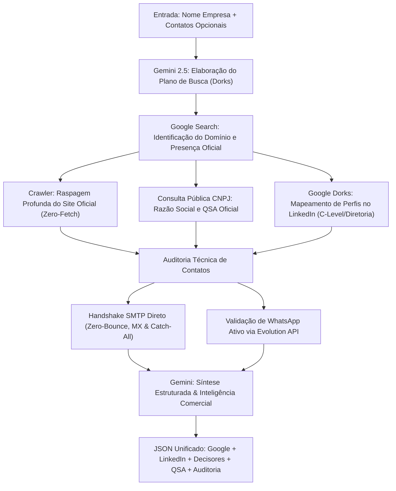

# 🎯 API de Enriquecimento de Leads e Inteligência Corporativa (Omni-Flow)

A **API de Enriquecimento de Leads do Omni-Flow** é um motor autônomo de inteligência corporativa e OSINT voltado para qualificação comercial de alta precisão. 

Utilizando modelos de linguagem Google Gemini, raspagem profunda de sites corporativos, cruzamento com o **QSA (Quadro de Sócios e Administradores) da Receita Federal**, consultas avançadas ao **LinkedIn (sem dependência de bot logado)** e **validação SMTP Zero-Bounce** ativa com detecção de **WhatsApp**, a API transforma um simples nome de empresa ou lista de contatos brutos em um dossiê comercial 360° pronto para vendas.

---

## 🏛 Arquitetura do Pipeline de Enriquecimento



---

## 🔑 Autenticação e Configuração

- **Base URL Interna:** `http://127.0.0.1:8000`
- **Header Opcional / Gateway:** `X-API-Key: <CHAVE_CONFIGURADA>` (quando acessado externamente via Nginx ou Reverse Proxy).

---

## 📑 Resumo dos Endpoints

| Método | Endpoint | Tipo | Descrição |
| :--- | :--- | :--- | :--- |
| `POST` | `/api/v1/enrich` | Síncrono | **Endpoint Principal:** Enriquecimento 360° consolidado (Google + LinkedIn + QSA + Contatos). |
| `GET` | `/api/v1/enrich` | Síncrono | Versão GET com query parameters para consultas rápidas. |
| `POST` | `/api/v1/enrich/company` | Síncrono | Dados cadastrais, presença digital, dores de mercado e pitch comercial. |
| `GET` | `/api/v1/enrich/company` | Síncrono | Versão GET para enriquecimento de dados da empresa. |
| `POST` | `/api/v1/enrich/company/async` | Assíncrono | Enfileira no Celery e retorna `task_id` imediatamente. |
| `POST` | `/api/v1/enrich/decision-makers` | Síncrono | Mapeamento de C-Level, Diretores e Heads com cruzamento no QSA da Receita. |
| `GET` | `/api/v1/enrich/decision-makers` | Síncrono | Versão GET para busca de tomadores de decisão. |
| `POST` | `/api/v1/enrich/decision-makers/async` | Assíncrono | Busca de tomadores de decisão assíncrona via fila Celery. |
| `POST` | `/api/v1/enrich/company/full` | Síncrono | Combina perfil detalhado da empresa e tomadores de decisão. |
| `POST` | `/api/v1/enrich/linkedin/company` | Síncrono | Extração exclusiva dos dados institucionais da Company Page no LinkedIn. |
| `GET` | `/api/v1/enrich/linkedin/company` | Síncrono | Versão GET para extração da Company Page no LinkedIn. |
| `POST` | `/api/v1/enrich/verify-email` | Síncrono | Validação ativa de e-mail por handshake SMTP direto (zero-bounce). |
| `GET` | `/api/v1/enrich/verify-email` | Síncrono | Versão GET de validação SMTP. |

---

## 📡 Detalhamento dos Endpoints Principais

### 1. `POST /api/v1/enrich` — Enriquecimento Unificado (Principal)

Consolida a pesquisa institucional (Google, site oficial, CNPJ/QSA) e executiva (LinkedIn, sócios, verificação de e-mails corporativos e números de WhatsApp).

#### Payload de Entrada (`QuickEnrichRequest`)

```json
{
  "name": "Matera",
  "location": "Campinas SP",
  "deep_scrape": true,
  "people": ["Carlos Netto", "Roberto Matos"],
  "emails": ["carlos@matera.com", "comercial@matera.com"],
  "phones": ["1937071200", "19999998888"],
  "contacts": [
    {
      "nome": "Carlos Netto",
      "cargo": "CEO",
      "email": "carlos@matera.com",
      "telefone": "1937071200"
    }
  ]
}
```

> **Aliases aceitos automaticamente no payload:**
> - Nome da empresa: `name`, `company_name`, `company`, `empresa`
> - Localização: `location`, `location_hint`, `cidade`, `estado`
> - Pessoas: `people`, `target_people`, `person`, `pessoa`
> - E-mails: `emails`, `provided_emails`, `email`, `mail`
> - Telefones: `phones`, `provided_phones`, `phone`, `telefone`, `celular`, `whatsapp`

#### Exemplo de Chamada cURL

```bash
curl -X POST http://127.0.0.1:8000/api/v1/enrich \
  -H "Content-Type: application/json" \
  -d '{
    "name": "Matera",
    "location": "Campinas SP",
    "people": ["Carlos Netto"],
    "emails": ["carlos@matera.com"]
  }'
```

#### Exemplo de Resposta (`UnifiedEnrichmentResponse`)

```json
{
  "status": "SUCCESS",
  "nome_pesquisado": "Matera",
  "google": {
    "razao_social": "Matera Informática S.A.",
    "nome_fantasia": "Matera",
    "cnpj": "58.749.123/0001-00",
    "situacao_cadastral": "ATIVA",
    "sede": "Campinas, SP",
    "website_oficial": "https://www.matera.com",
    "telefones": ["(19) 3707-1200"],
    "emails": ["contato@matera.com"],
    "setor": "Tecnologia / Fintech",
    "nicho": "Core Banking e Soluções para Pix",
    "porte_estimado": "Grande Empresa / Enterprise",
    "o_que_faz": "Desenvolve soluções integradas de tecnologia bancária, core banking e processamento de pagamentos instantâneos para bancos e fintechs.",
    "produtos_servicos": [
      "Matera Core Banking",
      "Matera Pix & Instant Payments",
      "Digital Accounts",
      "Financial Services Platform"
    ],
    "fontes_google": [
      "https://www.matera.com",
      "https://cnpj.biz/58749123000100"
    ]
  },
  "linkedin": {
    "company_url": "https://br.linkedin.com/company/matera",
    "empresa": {
      "nome": "Matera",
      "url": "https://br.linkedin.com/company/matera",
      "tagline": "Pioneering the future of financial services and instant payments.",
      "sobre": "A Matera é uma empresa brasileira de tecnologia líder em soluções para o mercado financeiro...",
      "setor": "Serviços e consultoria de TI",
      "faixa_funcionarios": "501-1.000 funcionários",
      "total_seguidores": "85.000+ seguidores",
      "sede": "Campinas, São Paulo",
      "ano_fundacao": "1987",
      "tipo_empresa": "Privada"
    },
    "total_decisores_encontrados": 2,
    "decisores": [
      {
        "nome": "Carlos Netto",
        "cargo": "Co-founder & CEO",
        "nivel_hierarquico": "C-Level / Sócio-Fundador",
        "departamento": "Diretoria Geral",
        "linkedin_url": "https://br.linkedin.com/in/carlosnetto",
        "email_provavel": "carlos@matera.com",
        "padrao_email": "nome@matera.com",
        "status_email": "VALIDADO_SMTP",
        "origem_dado": "QSA_RECEITA_FEDERAL",
        "pertence_ao_qsa": true,
        "cargo_qsa": "Presidente / Sócio Administrador",
        "whatsapp_valido": true,
        "emails_associados": ["carlos@matera.com"],
        "telefones_associados": ["1937071200"]
      }
    ]
  },
  "contatos_enriquecidos_usuario": [
    {
      "nome": "Carlos Netto",
      "cargo": "CEO & Founder",
      "nivel_hierarquico": "C-Level / Sócio-Fundador",
      "departamento": "Diretoria Geral",
      "linkedin_url": "https://br.linkedin.com/in/carlosnetto",
      "pertence_ao_qsa": true,
      "cargo_qsa": "Presidente / Sócio Administrador",
      "status_email": "VALIDADO_SMTP",
      "whatsapp_valido": true,
      "origem_dado": "ENVIADO_PELO_USUARIO",
      "emails_associados": ["carlos@matera.com"],
      "telefones_associados": ["1937071200"]
    }
  ],
  "auditoria_contatos": {
    "total_emails_fornecidos": 1,
    "emails_validos": ["carlos@matera.com"],
    "padrao_corporativo_emails": "primeironome@matera.com",
    "emails_auditados": [
      {
        "email": "carlos@matera.com",
        "valido": true,
        "status": "VALIDADO_SMTP",
        "mx_host": "aspmx.l.google.com",
        "is_catch_all": false
      }
    ],
    "total_telefones_fornecidos": 1,
    "telefones_com_whatsapp": ["(19) 3707-1200"],
    "telefones_auditados": [
      {
        "telefone_original": "1937071200",
        "telefone_formatado": "+551937071200",
        "valido": true,
        "whatsapp_ativo": true
      }
    ]
  },
  "inteligencia_comercial": {
    "dor_de_mercado_resolvida": "Alta complexidade e custos regulatórios em infraestrutura bancária legada e adequação contínua às normativas do Banco Central para pagamentos instantâneos.",
    "sugestao_pitch_vendas": "Abordar como nosso serviço/produto complementa a esteira de inovação sem exigir a refatoração do core transacional.",
    "melhor_ponto_de_contato": "Carlos Netto (CEO) ou Diretor de Novos Negócios",
    "nivel_confianca": "ALTA"
  },
  "execution_time_seconds": 4.12
}
```

---

### 2. `GET /api/v1/enrich` — Versão GET via Query String

Ideal para integrações diretas via URL, automações leves ou testes rápidos no browser.

#### Parâmetros de Consulta:
- `name` (obrigatório): Nome da empresa.
- `location` (opcional): Cidade ou Estado.
- `deep_scrape` (opcional, padrão `true`): Rastreamento detalhado do site.
- `people` (opcional): Pessoas separadas por vírgula (`Carlos Netto, Roberto Matos`).
- `emails` (opcional): E-mails para auditoria separados por vírgula.
- `phones` (opcional): Telefones separados por vírgula.

#### Exemplo:
```bash
curl "http://127.0.0.1:8000/api/v1/enrich?name=Matera&location=Campinas&people=Carlos+Netto&emails=carlos@matera.com"
```

---

### 3. `POST /api/v1/enrich/decision-makers` — Mapeamento de Decisores

Pesquisa executivos de alta liderança (C-Level, Diretores, VPs, Heads) da organização e faz o cruzamento imediato com o quadro societário da Receita Federal.

#### Payload:
```json
{
  "company_name": "Totvs",
  "website_or_domain": "totvs.com",
  "target_departments": ["Tecnologia", "Vendas", "Diretoria"],
  "target_seniorities": ["C-Level", "Diretor", "VP"],
  "max_results": 10
}
```

#### Destaques dos Campos Retornados:
- `pertence_ao_qsa`: Se o profissional consta como sócio ou administrador no registro público da Receita Federal.
- `cargo_qsa`: Cargo societário oficial registrado no CNPJ (ex: `Presidente`, `Diretor`, `Sócio-Administrador`).
- `email_provavel`: E-mail gerado com base no algoritmo heurístico do padrão corporativo da empresa e validado via SMTP.
- `whatsapp_valido`: Confirmação se o número telefônico possui conta ativa no WhatsApp.

---

### 4. `POST /api/v1/enrich/verify-email` — Handshake SMTP Ativo (Zero-Bounce)

Verifica se uma caixa postal realmente existe no servidor de correio MX corporativo **sem disparar mensagens** de e-mail ao destinatário.

#### Payload:
```json
{
  "email": "carlos@matera.com"
}
```

#### Resposta:
```json
{
  "email": "carlos@matera.com",
  "status": "VALIDADO_SMTP",
  "valido": true,
  "mx_host": "aspmx.l.google.com",
  "smtp_code": 250,
  "is_catch_all": false,
  "detalhe": "Caixa de correio confirmada pelo servidor MX remoto.",
  "execution_time_seconds": 0.45
}
```

#### Possíveis Status de Validação SMTP:
| Status | Significado |
| :--- | :--- |
| `VALIDADO_SMTP` | Servidor MX respondeu código `250 OK` para o comando `RCPT TO`. Caixa garantida. |
| `CATCH_ALL` | Domínio aceita qualquer e-mail arbitrário; o e-mail não dará bounce imediato, mas pode ser alias geral. |
| `INVALIDO` | Servidor rejeitou expressamente (`550 Mailbox does not exist`). |
| `SEM_MX` | Domínio não possui registros MX válidos na zona de DNS. |
| `SINTAXE_INVALIDA` | Endereço com formato fora dos padrões RFC. |
| `ERRO_CONEXAO` | Timeout ou bloqueio de firewall na porta 25 do servidor MX remoto. |

---

## ⚡ Enfileiramento Assíncrono (Celery Tasks)

Para pipelines com centenas ou milhares de leads em lote, utilize as rotas assíncronas terminadas em `/async`:

1. Dispare a requisição:
   ```bash
   curl -X POST http://127.0.0.1:8000/api/v1/enrich/company/async \
     -H "Content-Type: application/json" \
     -d '{"company_name": "Nubank"}'
   ```
2. Resposta imediata:
   ```json
   {
     "status": "QUEUED",
     "task_id": "9d8ef6a2-632b-426b-9c3f-c3971e44f808",
     "company_name": "Nubank",
     "message": "Enriquecimento enviado para a fila Celery com sucesso."
   }
   ```
3. O status e resultado podem ser monitorados via Flower em `http://127.0.0.1:5555` ou consultados via endpoint de tarefas Celery.

---

## 💻 Exemplo de Integração em Python

```python
import requests

def enriquecer_lead(empresa: str, contato_nome: str = None, email: str = None):
    url = "http://127.0.0.1:8000/api/v1/enrich"
    payload = {
        "name": empresa,
        "people": [contato_nome] if contato_nome else [],
        "emails": [email] if email else [],
        "deep_scrape": True
    }
    
    resp = requests.post(url, json=payload, timeout=60)
    resp.raise_for_status()
    dados = resp.json()
    
    print(f"🏢 Razão Social: {dados['google']['razao_social']}")
    print(f"📑 CNPJ: {dados['google']['cnpj']}")
    print(f"🎯 Resumo: {dados['google']['o_que_faz']}")
    print(f"💡 Pitch Sugerido: {dados['inteligencia_comercial']['sugestao_pitch_vendas']}")
    
    for decisor in dados["linkedin"]["decisores"]:
        print(f"👤 {decisor['nome']} — {decisor['cargo']} (QSA: {decisor['pertence_ao_qsa']})")
    
    return dados

if __name__ == "__main__":
    enriquecer_lead("Matera", "Carlos Netto", "carlos@matera.com")
```
