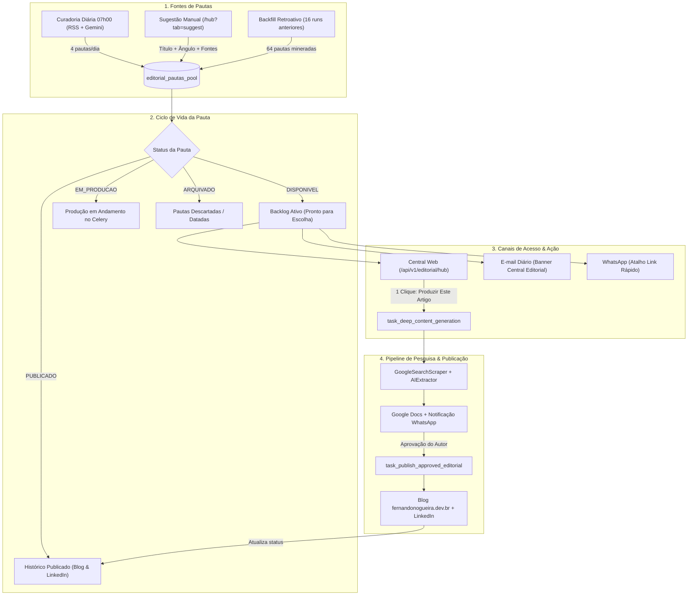

# Central Editorial & Banco de Pautas (Backlog Dinâmico & Sugestão de Temas)

Este documento descreve a arquitetura, o modelo de dados, as rotas web e as integrações multicanal do **Upgrade do Sistema Editorial** no [`playwright-celery-automation`](file:///root/playwright-celery-automation).

---

## 1. Visão Geral e Motivação

O ecossistema editorial de `fernandonogueira.dev.br` gera diariamente às 07h00 uma curadoria de 4 pautas (2 de TI e 2 de Música) com base em feeds RSS e inteligência artificial do Google Gemini. 

Antes desta implementação, as 3 pautas não selecionadas no dia acabavam se perdendo no histórico de e-mails ou mensagens de WhatsApp, e não havia uma interface para resgatar temas anteriores nem para sugerir um tema autoral sob demanda.

Com a **Central Editorial Web** (`/api/v1/editorial/hub`):
1. **Backlog Ativo de Pautas:** Todo tema curado é armazenado em uma fila persistente no SQLite (`editorial_pautas_pool`), permanecendo disponível até ser produzido ou arquivado.
2. **Carga Histórica (Backfill):** 64 pautas mineradas nos 16 ciclos diários anteriores foram catalogadas retroativamente (46 disponíveis imediatamente para produção).
3. **Sugestão Manual de Temas:** Interface para propor novas ideias de pauta, com opção de salvar no banco ou disparar a pesquisa profunda e redação autônoma imediata (1 clique).
4. **Integração Multicanal Contínua:** Atalhos diretos incorporados ao e-mail diário e à mensagem de WhatsApp da Evolution API.

---

## 2. Arquitetura e Ciclo de Vida do Conteúdo



### Estados da Pauta (`status`)
* `DISPONIVEL`: Pauta pronta para seleção no backlog. Não foi produzida ainda.
* `EM_PRODUCAO`: Pesquisa profunda e redação de 4 canais em execução pelo Celery.
* `PRONTO_REVISAO`: Google Doc criado e link de aprovação gerado.
* `PUBLICADO`: Artigo oficialmente veiculado no Blog e no LinkedIn.
* `ARQUIVADO`: Pauta que ficou datada ou foi descartada pelo autor (pode ser restaurada a qualquer momento).

---

## 3. Modelo de Banco de Dados (`editorial_pautas_pool`)

A tabela é criada automaticamente no SQLite (`/app/data/pipeline.db`):

```sql
CREATE TABLE IF NOT EXISTS editorial_pautas_pool (
    id INTEGER PRIMARY KEY AUTOINCREMENT,
    uuid TEXT UNIQUE NOT NULL,
    titulo TEXT NOT NULL,
    categoria TEXT NOT NULL,
    origem TEXT NOT NULL DEFAULT 'DAILY_CURATION', -- 'DAILY_CURATION' | 'MANUAL'
    angulo_editorial TEXT,
    sintese_factual TEXT,
    roteiro_topicos TEXT, -- JSON array
    fontes TEXT,          -- JSON array
    status TEXT NOT NULL DEFAULT 'DISPONIVEL', -- DISPONIVEL | EM_PRODUCAO | PRONTO_REVISAO | PUBLICADO | ARQUIVADO
    task_id TEXT,
    action_token TEXT,
    created_at TIMESTAMP DEFAULT CURRENT_TIMESTAMP,
    selected_at TIMESTAMP,
    published_at TIMESTAMP
);

CREATE INDEX IF NOT EXISTS idx_pautas_pool_status ON editorial_pautas_pool(status);
CREATE INDEX IF NOT EXISTS idx_pautas_pool_categoria ON editorial_pautas_pool(categoria);
CREATE INDEX IF NOT EXISTS idx_pautas_pool_created ON editorial_pautas_pool(created_at);
```

### Métodos no Repositório ([`storage/repository.py`](file:///root/playwright-celery-automation/storage/repository.py))
* `save_editorial_pauta(...)`: Insere pauta com validação de campos e serialização JSON.
* `list_editorial_pautas_pool(status, categoria, origem, search, limit, offset)`: Listagem flexível com suporte a filtros combinados e busca semântica por texto.
* `get_editorial_pauta(pauta_id_or_uuid)`: Recupera registro individual por ID numérico ou UUID.
* `update_editorial_pauta_status(pauta_id_or_uuid, status, selected_at, published_at)`: Transições de estado com registro de timestamp.
* `get_editorial_pautas_stats()`: Retorna contadores agregados em tempo real (total, disponíveis, em produção, publicados, arquivados, TI, Música, manuais).
* `_backfill_editorial_pautas_pool(conn)`: Migração automática que ingere as execuções antigas de `flow_executions` e cruza com os artigos publicados de `editorial_publications`.

---

## 4. Endpoints da Central Editorial Web

A Central Editorial é servida sob o prefixo `/api/v1/editorial`:

| Rota | Método | Descrição |
| :--- | :--- | :--- |
| `/api/v1/editorial/hub` | `GET` | Dashboard completo com abas de backlog, sugestão, artigos publicados e arquivadas. Suporta `?tab=`, `?cat=`, `?q=` e `?msg=`. |
| `/api/v1/editorial/hub/suggest` | `POST` | Processa formulário de novo tema com modos `action_mode=save` (guardar) ou `action_mode=produce` (produzir já). |
| `/api/v1/editorial/hub/produce/{id}` | `GET` | Aciona a pesquisa profunda e geração imediata no Celery com 1 clique para uma pauta do backlog. |
| `/api/v1/editorial/hub/archive/{id}` | `GET` | Alterna o status da pauta entre `ARQUIVADO` e `DISPONIVEL` (ação de toggle reversível). |
| `/api/v1/editorial/select` | `GET` | Callback assinado do e-mail matinal das 07h00 (atualiza o status da pauta selecionada para `EM_PRODUCAO`). |
| `/api/v1/editorial/publish` | `GET` | Callback de aprovação final que publica no Blog e LinkedIn (atualiza para `PUBLICADO`). |

---

## 5. Como Operar a Central Editorial

### Acesso à Central
Acesse diretamente via navegador:
```
https://www.fernandonogueira.dev.br/api/v1/editorial/hub
```

### Cenário A: Produzir um tema do passado
1. Na aba **Banco de Pautas**, navegue pelas pautas disponíveis ou use a busca textual.
2. Use os filtros `💻 Tecnologia` ou `🎵 Música` para afunilar por nicho.
3. Clique no botão **`🚀 Produzir Este Artigo`**.
4. O sistema confirma a solicitação, marca a pauta como `EM_PRODUCAO` e aciona o robô no Celery (`task_deep_content_generation`).
5. Em poucos minutos, você receberá a notificação com o link do Google Docs no WhatsApp e e-mail para aprovação.

### Cenário B: Sugerir um novo tema autoral
1. Clique na aba **💡 Sugerir Novo Tema**.
2. Preencha o **Título** (obrigatório), a **Categoria** e, se desejar, o **Ângulo Editorial** e **Links de Apoio**.
3. Escolha uma das duas ações:
   * **`💾 Guardar no Banco de Pautas`**: A pauta fica salva no backlog com a badge `💡 Manual`, pronta para você produzir quando quiser.
   * **`⚡ Produzir Imediatamente (1 Clique)`**: Salva a pauta e já dispara a investigação no Google, extração de dados e redação multicanal na hora.

### Cenário C: Arquivar pautas datadas
1. Se um tema de semanas atrás perdeu a relevância temporal, clique em **`🗑️ Arquivar`**.
2. O tema sai do backlog ativo e vai para a aba **📦 Arquivadas**.
3. Caso queira recuperá-lo no futuro, basta clicar em **`♻️ Restaurar para Backlog`**.
